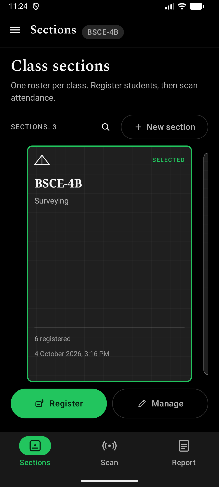
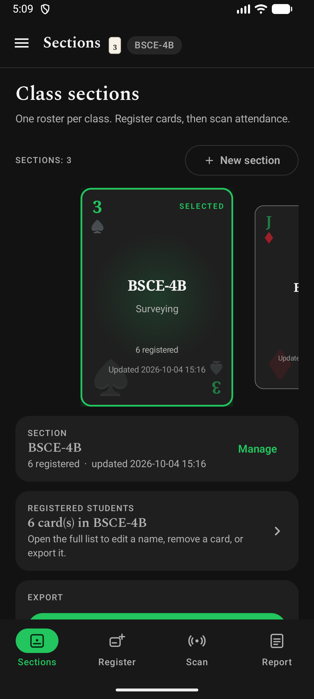
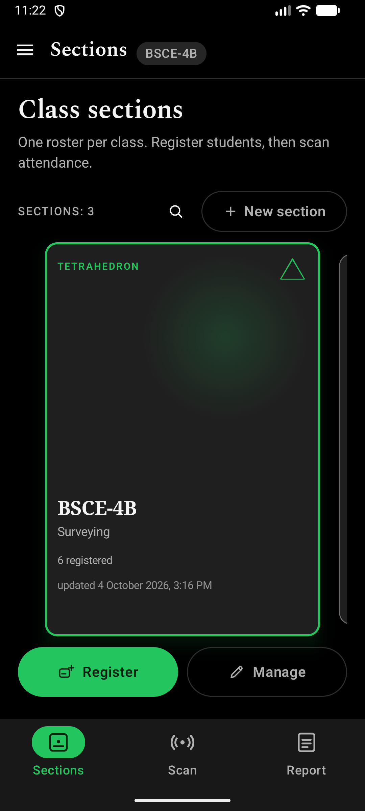
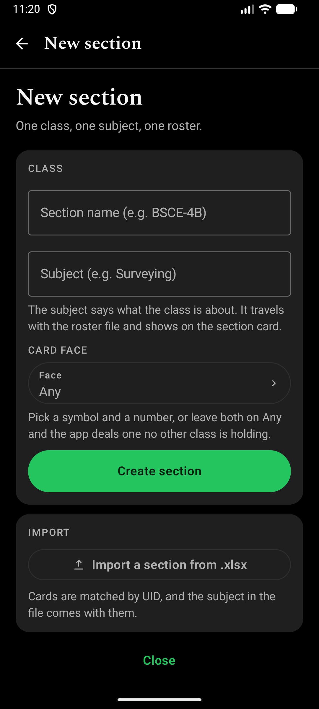
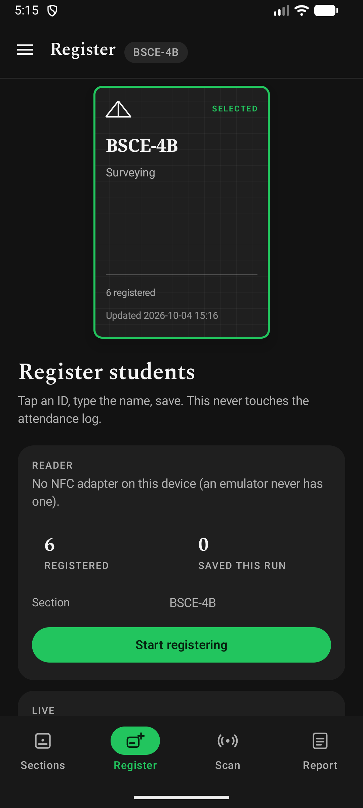
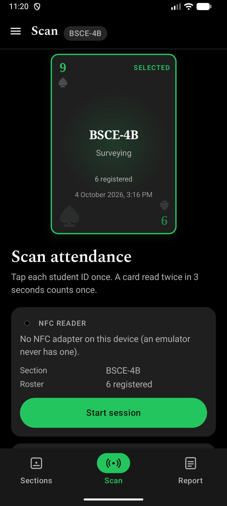
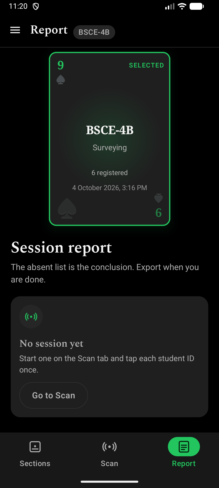

#  Presencia NFC - Attendance Checker


## **Tap your ID. Be Present.**

An offline Android app for taking class attendance by tapping student ID cards.

Built for a **class beadle**: one roster per class, tap each card once, then export the session as an Excel workbook. The app ships as **Presencia NFC**; the repository keeps its original name.

**No server. No network permission. No student numbers** — a student is a name and a card UID, nothing else.

## ✨ What it does

- **🎴 Sections** — one card per class, each with its own subject and roster. The shelf is a **centred carousel**; the middle card is the selected class. The magnifier beside *New section* searches the shelf by **class name, subject, or card face** and brings a match to the middle.

- **🪪 Register** — tap an ID card, type the name, and save. A card already on the roster **updates its name** instead of adding a second row.

- **📡 Scan** — tap each card once per session. A repeat read inside **3 seconds** counts once. A card read more than **15 minutes** after the session starts is still counted, but marked **late**. The threshold can be set to **10/15/20/30 minutes**. The session can also be paused and left open for late arrivals.

- **📋 Report** — **absent** first, then **late**, **present**, and **unmatched** cards. Every attendance row carries the **date and time** of the read.

- **📊 Export / Import** — write the report or roster to `.xlsx` in the shared **`Documents/Presencia`** folder, or import a roster exported from another phone. Rows merge by **card UID**, and the **subject travels with the file**.

## Section styles

Settings carries a section style, applied to the section cards, the badges and
the tabs that work with a section.

| Plain (default) | Cards | Solids |
| --- | --- | --- |
|  |  |  |

- **Plain** - a civil engineering drawing sheet: drafting grid, truss mark,
  title block.
- **Cards** - a face from a complete 52-card deck, drawn dark and subtle with
  green symbols that glow when the class is the chosen one. The face can also
  be picked by hand when the class is created.
- **Solids** - a wireframe polyhedron (tetrahedron, cube, octahedron,
  dodecahedron, icosahedron, prism) as a quiet corner mark.

## Screens

| New section | Register |
| --- | --- |
|  |  |

| Scan | Report |
| --- | --- |
|  |  |

Also included: a registered-students page for the full roster with per-student
standing, a full-screen student editor, a sidebar with Settings and the
tutorial, light and dark themes, a first-launch swipeable card tutorial, and
scan feedback (haptics strength and a beep on read).

## Privacy

Names and card UIDs live in this app's private storage only. The app has no
network permission, so nothing can be uploaded. The only data that leaves the
device is what you export yourself into `Documents/Presencia`. The RA 10173
privacy paragraph is shown in the app.

## Build

```bash
export JAVA_HOME="/path/to/Android/Studio/jbr"
./gradlew :app:assembleDebug          # APK
./gradlew :app:testDebugUnitTest      # unit tests
./gradlew :app:connectedDebugAndroidTest   # instrumented tests (needs a device)
```

Kotlin, Jetpack Compose and Material 3. Gradle builds the `.xlsx` writer and
reader by hand over `java.util.zip` - no Apache POI, no third-party spreadsheet
library, no charting or image-loading dependency.

## Documentation

- [CHANGELOG.md](CHANGELOG.md) - what changed between releases
- [docs/UI-UX-AUDIT.md](docs/UI-UX-AUDIT.md) - the ten ranked usability findings
- [docs/UI-UX-CHECKLIST.md](docs/UI-UX-CHECKLIST.md) - what was fixed, with evidence
- [docs/NFC-Attendance-Checker-Guide.html](docs/NFC-Attendance-Checker-Guide.html) - illustrated guide
- [docs/GITHUB-PUBLISH.md](docs/GITHUB-PUBLISH.md) - release steps

## Licence

See [LICENSE](LICENSE).
